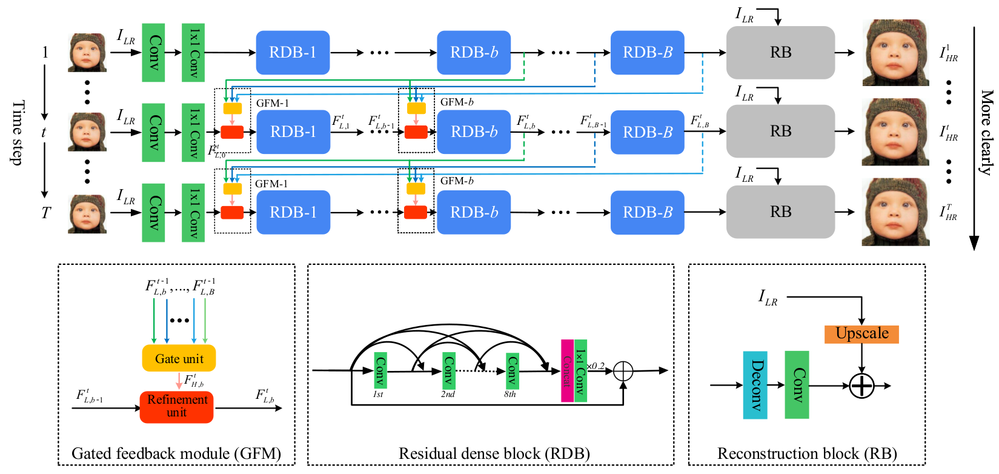

# Gated Multiple Feedback Network for Image Super-Resolution 

This repository contains the PyTorch implementation for the proposed GMFN [arXiv] (coming soon). 



The framework of our proposed GMFN. The colored arrows among different time steps denote the multiple feedback connections. The high-level information carried by them helps low-level features become more representative. 

## Demo

*Clone SRFBN as backbone and satisfy its requirements.* 

### Test

1. Copy [`./networks/gmfn_arch.py`](./networks/gmfn_arch.py) into `SRFBN_CVPR19/networks/`

2. Download the pre-trained models from [Google driver](https://drive.google.com/open?id=1SbsWaA3_WSi6cd0KklDrYFMKZOMeIfnN) or [Baidu Netdisk](https://pan.baidu.com/s/1rbozcfQ5JZ4sB9oyjEbIAg), unzip and place them into `SRFBN_CVPR19/models`.

3. Copy `./options/test/` to `SRFBN_CVPR19/options/test/`. 

4. Run commands  `cd SRFBN_CVPR19` and **one of followings ** for evaluation on *Set5*:

   ```shell
python test.py -opt options/test/test_GMFN_x2.json
python test.py -opt options/test/test_GMFN_x3.json
python test.py -opt options/test/test_GMFN_x4.json
   ```
   
5. Finally, PSNR/SSIM values for *Set5* are shown on your screen, you can find the reconstruction images in `./results`.

*To test GMFN on other standard SR benchmarks or your own images, please refer to the instruction in SRFBN.* 

### Train

1. Prepare the training set according to [this](https://github.com/Paper99/SRFBN_CVPR19/blob/master/README.md#train) (1-3).
2. Modify `./options/train/train_GMFN.json` by following the instruction in `./options/train/README.md`.
3. Run commands;

   ```shell
cd SRFBN_CVPR19
python train.py -opt options/train/train_GNFN.json
   ```

4. You can monitor the training process in `./experiments`.

5. Finally, you can follow the [test pipeline](https://github.com/liqilei/GMFN#test) to evaluate the model trained by yourself.

## Performance

#### Quantitative Results

Quantitative evaluation under scale factors x2, x3 and x4. The best performance is shown in **bold** and the second best performance is <u>underlined</u>.

#### More Qualitative Results (x4)


## Acknowledgment

If you find our work useful in your research or publications, please consider citing:

```latex
@inproceedings{li2019gmfn,
    author = {Li, Qilei and Li, Zhen and Lu, Lu and Jeon, Gwanggil and Liu, Kai and Yang, Xiaomin},
    title = {Gated Multiple Feedback Network for Image Super-Resolution},
    booktitle = {The British Machine Vision Conference (BMVC)},
    year = {2019}
}

@inproceedings{li2019srfbn,
    author = {Li, Zhen and Yang, Jinglei and Liu, Zheng and Yang, Xiaomin and Jeon, Gwanggil and Wu, Wei},
    title = {Feedback Network for Image Super-Resolution},
    booktitle = {The IEEE Conference on Computer Vision and Pattern Recognition (CVPR)},
    year= {2019}
}
```